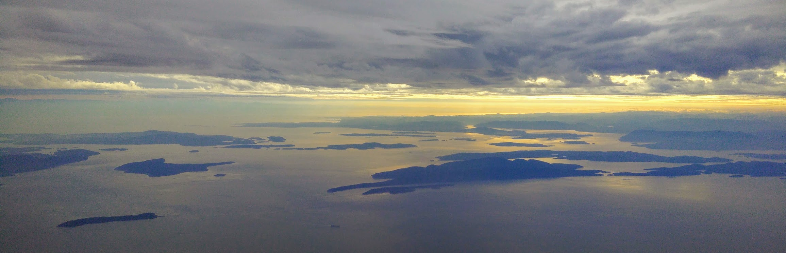

<!-- Google tag (gtag.js) -->

<!-- Banner Image -->

  

<meta name="google-site-verification" content="JTYMP4QvfeA_ey_V0Y4VKC-jxEP4XrDuqlYQw9baC5s" />

# Welcome to NetAI Research Group

led by Dr. Omar Alhussein

##  Research Interests
- Network intelligence, protocol design, semantic communications and learning
- Large-language models for the network, distributed learning, information-bottleneck theory
- Explainable and responsible AI

## News

<!-- ### August 2024 -->

<!-- - **competition participation**: The team has participated  -->

### July 2024
- **conference**: Dr. Omar Alhussein and Omar Erak attended Proc. IEEE/CIC ICCC in Hangzhou, China.

- **Seminar**: Presenting seminar at SFU on native AI techniques for the network. 

- **call for papers**: Announcing Globecom 2024 workshop, [the ubiquitous network intelligence for next generation wireless networks (UNI)](files/call_for_papers/m14867-zhangpaper.pdf). Join us and consider submitting!

- **patent granted**: [Method and apparatus for managing network traffic via uncertainty](https://patentimages.storage.googleapis.com/33/c1/41/2ff8f88ccf4847/US20230216811A1.pdf)

### June 2024
- **accepted paper**: Our latest paper on [LLM-based curriculum design for mobile networks](https://arxiv.org/abs/2405.18039v2) has been accepted to Proc. IEEE/CIC ICCC. [Code available](https://github.com/OmarErak/LLM-CL){: .btn }

- **submitted paper**: We have submitted a vision magazine manuscript on [active machine learning for 6G networks](https://arxiv.org/abs/2406.03630). [Code available](https://github.com/OmarSababha/active_ML){: .btn }

- **research leave**: I will be on a research leave to Simon Fraser University, Canada, for Summer 2024. Thanks to Dr. [Cheng Li](https://www.sfu.ca/engineering/faculty-and-staff/faculty/cheng_li.html) and Dr. [Jie Liang](https://www.sfu.ca/~jiel/) for hosting. Looking forward to fruitful collaborations.

- **new intern**: Welcome to [Hatim Lucman](https://www.linkedin.com/in/hatim-lucman-899527286/), who will join for a summer internship with the [KU-6GRC](https://www.ku.ac.ae/6grc). His work will revolve around mobile core research and development

- **new undergraduate associate**: Welcome to Amr Hussien (undergraduate student @KU). Amr has strong experience in LLM development and he will join the team on research on LLM for telecom.

<!-- 

I am an Assistant Professor at Khalifa University, Abu Dhabi, United Arab Emirates. From 2020 to 2023, I worked as a senior research engineer with Huawei Ottawa Research and Development Centre.

I received my Ph.D. degree with the [BBCR lab](https://uwaterloo.ca/broadband-communications-research-lab/) at the University of Waterloo under the supervision of Prof. [Weihua Zhuang](https://bbcr.uwaterloo.ca/~wzhuang/). My [thesis](research_phd.html) focuses on the orchestration and provisioning of network function virtualization enabled multicast services.

My MASc was obtained from Simon Fraser University under the supervision of Prof. [Jie Liang](https://www.sfu.ca/~jiel/) and Prof. [Sami Muhaidat](https://sites.google.com/view/muhaidat/home?authuser=0). My [thesis](research_masc.html) is on the performance analysis of generalized and composite wireless fading channels through the use of mixture distributions.

Please feel free to contact me for anything.
 -->

<!-- ## Connect

- Email: [oalhusse@gmail.com](mailto:oalhusse@gmail.com)
- [Google Scholar](https://scholar.google.ca/citations?user=_4mKHpcAAAAJ&hl=en)
- [ResearchGate](https://www.researchgate.net/profile/Omar_Alhussein) -->

