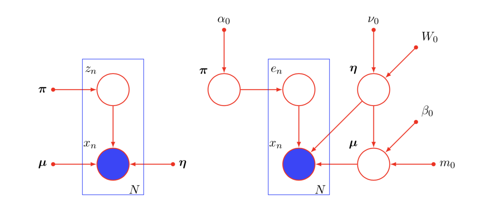

# Featured and Current Research Projects

## Goal-oriented Semantic-based Networks
{: .profile-pic }

## AI for Net (2020 - present)

{: .profile-pic }
How to re-design the access and core networks with AI in a native manner. Three works that utilize split inference with the information-bottleneck theory are proposed to enable and enhance network and application functions in the core and the access. Moreover, through information-theoretic observations, we provide native architectures and methods that both enhance the learning process and optimize processing and transmission resources. We also propose and develop a method that utilizes probabilistic models (and generative models) to enhance traffic engineering and traffic acquisition. More information to be disclosed soon (pending patent submissions).

## Joint Composition, Placement and Routing for Multicast Services

{: .profile-pic }
The paradigm of network function virtualization (NFV) with the support of software defined networking has emerged as a promising approach to reduce the complexity in managing modern communication networks. In the past, functions, which can manipulate the packet header and context of traffic flows, used to be implemented by the end-users or at fixed locations in the physical substrate inside proprietary physical devices (called middlewares). With NFV, such functions are softwarized and virtualized and therefore can be deployed in commodity servers as demanded. An approach that relies on establishing service-customized networks has the potential to greatly resolve the complexity in conventional networks and to meet new demands and use cases. However, it leads to new research opportunities and challenges.

In this PhD research, we will focus on three research problems essential to the orchestration of NFV-enabled network services which are of multicast nature. An NFV-enabled multicast network service connects a source with a set of destinations. It specifies a set of network functions that should be deployed on the chosen routes from the source to the destinations, with some properties and dependence relationships that should be satisfied. A network service can be represented by a logical topology called service function chain (SFC).

## Performance Analysis of Wireless Fading Channels: A Unified Approach

{: .profile-pic }
This research project two major contributions. First, we consider a unified approach to model and simplify wireless fading channels or potentially fading scenarios by **mixture distributions**, namely using the **mixture of Gaussian (MoG)** and the **mixture Gamma (MG)** distributions. The approximation methodologies rely on maximum a posteriori and likelihood estimation techniques, such as the expectation-maximization and variational Bayes. Through the use of the mean-square error and the Kullback-Leibler divergence measures, we show that our models provide similar accuracy yet simpler representation than other existing models. In addition, we provide closed-form expressions or approximations for several performance metrics used in wireless communication systems, including the moment generating function, the raw moments, the amount of fading, the outage probability, and the average channel capacity.

Second, through the use of the MoG and MG distributions, we provide a unifying and versatile performance analysis over intricate generalized and composite fading channels in several contemporary wireless research topics, such as cognitive radio networks, cooperative- and diversity-based communications, and impulsive noise environments. The new approach and proposed distributions resolve intractable problems in many other fields, such as cognitive radio networks, cooperative networks, cascaded wireless applications and others.

## Simplified Subspacing for Big Data

{: .profile-pic }
To deal with the large-scale datasets, a data reduction technique that utilizes Voronoi-based data partitioning and clustering techniques is proposed.

Our proposed data reduction algorithm consists of two main stages. In the first stage, a Voronoi partitioning technique clusters the whole input vector space into smaller Voronoi regions based on some randomly selected representative samples. Our motivation beyond this stage is to reduce the complexity of the next stage. We assume that in large scale data, very far away points should not have a big influence on each other. In addition, this stage would allow for parallel computing techniques. In the second stage, we utilize the clustering algorithms to fetch the centroids of each Voronoi region to represent all original input vectors. The collection of all centroids constitutes the newly reduced dataset, C. Thereby, the time to build the subsequent classifier models could be reduced significantly.

## Spectrum Sensing Techniques for OFDM-Based Cognitive Radio Networks

{: .profile-pic }
The need for efficient utilization of spectrum has become a fundamental requirement in modern wireless networks, which is mainly due to spectrum scarcity and the ever-increasing demand for higher data rate applications and internet services. Cognitive radios have shown to be very efficient in maximizing spectrum utilization due to its inherent spectrum sensing capability. In a cognitive radio network environment, different users can be categorized as Primary Users (PUs), who are known as users having higher priority, and Secondary Users (SUs), who represent those users wishing to opportunistically access the spectrum.

Three detection techniques are commonly used for spectrum sensing in CRs, namely, energy detection, matched filters, and cyclostationary detection. In energy detection which is the one with less complexity, the presence of a PU signal is simply detected by comparing the output of the energy detector with a certain threshold that depends on signal-to-noise ratio in the system.

A user friendly energy detector was implemented using GNU Radio. It basically utilizes the spectrum, when detecting a whitespace. The user is prompted to choose an appropriate threshold, frequency band, and sensing time. An audio feedback helps the user to recognize spectrum holes.
