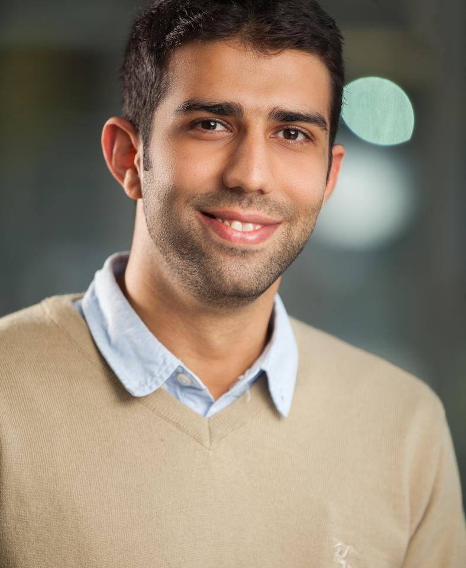
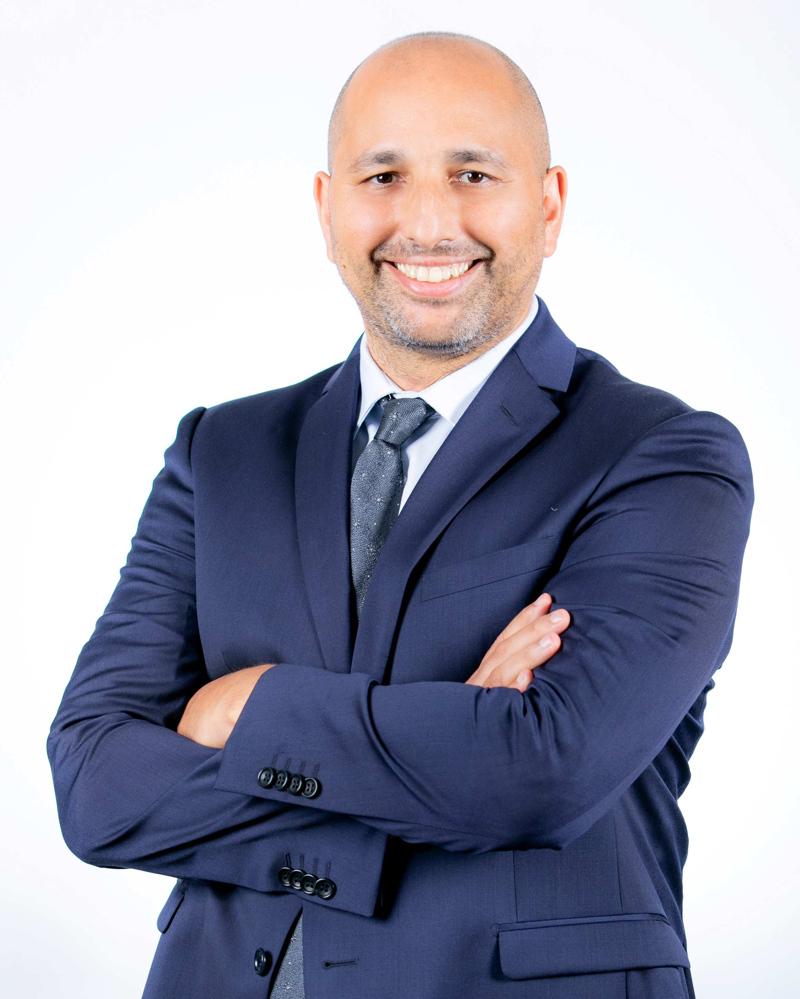
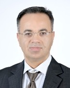
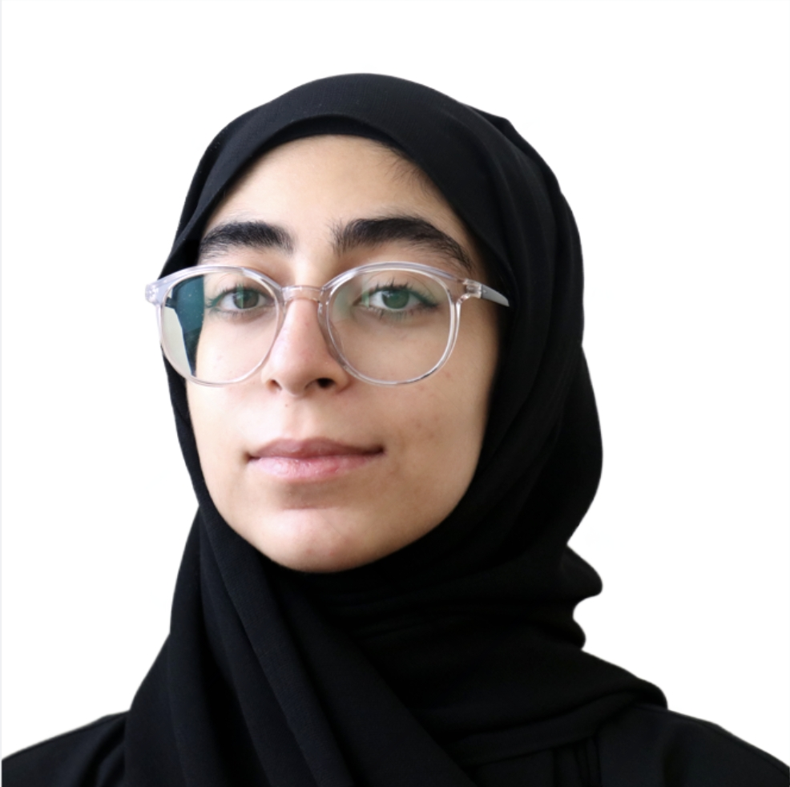

<!-- Google tag (gtag.js) -->

# Our Team

## Team Lead

{: style="width: 150px;"}

**Dr. Omar Alhussein**, Assistant Professor

I am currently an assistant professor with the computer science department at Khalifa University, United Arab Emirates, and a member of the <a href="https://www.ku.ac.ae/6grc">KU 6G Research Center (KU-6GRC)</a> under the native AI theme. Prior to joining Khalifa University, I have worked as a senior research engineer with the advanced networking team at Huawei Technologies Canada, Ottawa, Canada, from 2020 to 2023.  
I have received my Ph.D. degree with the <a href="https://uwaterloo.ca/broadband-communications-research-lab/">BBCR lab</a> at the University of Waterloo under the supervision of Prof. <a href="https://bbcr.uwaterloo.ca/~wzhuang/">Weihua Zhuang</a>. My <a href="research_phd.html">thesis</a> focuses on the orchestration and provisioning of network function virtualization enabled multicast services.  
I have received my MASc degree from Simon Fraser University under the supervision of Prof. <a href="https://www.sfu.ca/~jiel/">Jie Liang</a> and Prof. <a href="https://sites.google.com/view/muhaidat/home?authuser=0">Sami Muhaidat</a>. My <a href="research_masc.html">thesis</a> is on the performance analysis of generalized and composite wireless fading channels through the use of mixture distributions.  

### Connect
- Email: [omar.alhussein@ku.ac.ae](mailto:omar.alhussein@ku.ac.ae)
- [Google Scholar](https://scholar.google.ca/citations?user=_4mKHpcAAAAJ&hl=en)
- [ResearchGate](https://www.researchgate.net/profile/Omar_Alhussein)
- [KU Profile](https://www.ku.ac.ae/college-people/omar-alhussein)

<!-- 
## Collaborators

{: style="width: 150px;"}
**Prof. Merouane Debbah**, Professor, Director of the <a href="https://www.ku.ac.ae/6grc">KU-6GRC</a>

{: style="width: 150px;"}
**Prof. Sami Muhaidat**, Professor, Acting Associate Dean of Research, Deputy Director of the <a href="https://www.ku.ac.ae/6grc">KU-6GRC</a>
 -->

<!-- ## Collaborators

{: style="width: 30px;"} {: style="width: 30px;"}

 -->
<!-- ## Collaborators

  
&nbsp; &nbsp;
  

 -->

## Postdoctoral Researchers

{: style="width: 150px;"}

**Dr. Ismail Lotfi**, PhD from NTU, Singapore.

To work on goal-oriented networks

## PhD Students

{: style="width: 150px;"} 

**Nouf Alabbasi**, BSc from NYU, AD. Co-supervision with Prof. <a href="https://www.ku.ac.ae/college-people/merouane-debbah"> Merouane Debbah </a> and Prof. <a href="https://www.ku.ac.ae/college-people/sami-muhaidat"> Sami Muhaidat</a>

To work on LLM for network operations and management

{: style="width: 150px;"}

<a href="https://www.ku.ac.ae/college-people/omar-erak"> **Omar Erak** </a>, BSc from University of Calgary. Co-supervision with Prof. <a href="https://www.ku.ac.ae/college-people/merouane-debbah"> Merouane Debbah </a> and Prof. <a href="https://www.ku.ac.ae/college-people/sami-muhaidat"> Sami Muhaidat</a>

To work on goal-oriented networks

<!-- ## Undergraduate Associates/Interns -->

