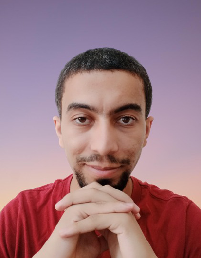
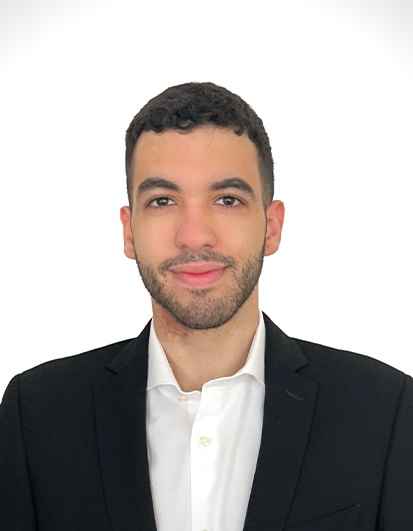

# Our Team

## Principal Investigator

{: style="width: 150px;"}
**Omar Alhussein**  
Assistant Professor at Khalifa University, Abu Dhabi, UAE

I am currently an assistant professor with the computer science department at Khalifa University, United Arab Emirates. Prior to joining Khalifa University, I have worked as a senior research engineer with the advanced networking team at Huawei Technologies Canada, Ottawa, Canada, from 2020 to 2023. 
I have received my Ph.D. degree with the [BBCR lab](https://uwaterloo.ca/broadband-communications-research-lab/) at the University of Waterloo under the supervision of Prof. [Weihua Zhuang](https://bbcr.uwaterloo.ca/~wzhuang/). My [thesis](research_phd.html) focuses on the orchestration and provisioning of network function virtualization enabled multicast services. 
I have received my MASc degree from Simon Fraser University under the supervision of Prof. [Jie Liang](https://www.sfu.ca/~jiel/) and Prof. [Sami Muhaidat](https://sites.google.com/view/muhaidat/home?authuser=0). My [thesis](research_masc.html) is on the performance analysis of generalized and composite wireless fading channels through the use of mixture distributions.

Please feel free to contact me for anything.

## Connect
- Email: [oalhusse@gmail.com](mailto:oalhusse@gmail.com)
- [Google Scholar](https://scholar.google.ca/citations?user=_4mKHpcAAAAJ&hl=en)
- [ResearchGate](https://www.researchgate.net/profile/Omar_Alhussein)

<!-- ## Collaborators

{: style="width: 150px;"}
**Prof. John Smith**  
University A

{: style="width: 150px;"}
**Prof. Emily White**  
University B -->

## Postdoctoral Researchers

{: style="width: 150px;"}
**Dr. John Doe**  
Thesis: Exploring AI in Network Optimization

## PhD Students

{: style="width: 150px;"}
**Nouf Alabbasi**  
Ph.D. Student

{: style="width: 150px;"}
**Sara Khan**  
M.Sc. Student

<!-- ## Undergraduate Associates/Interns -->

